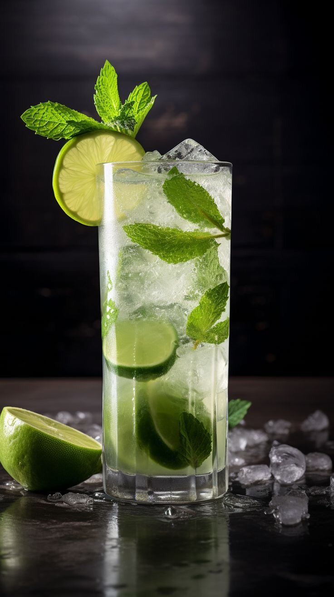
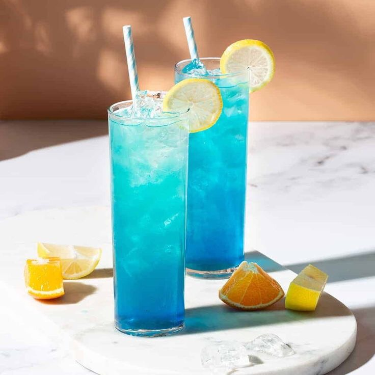
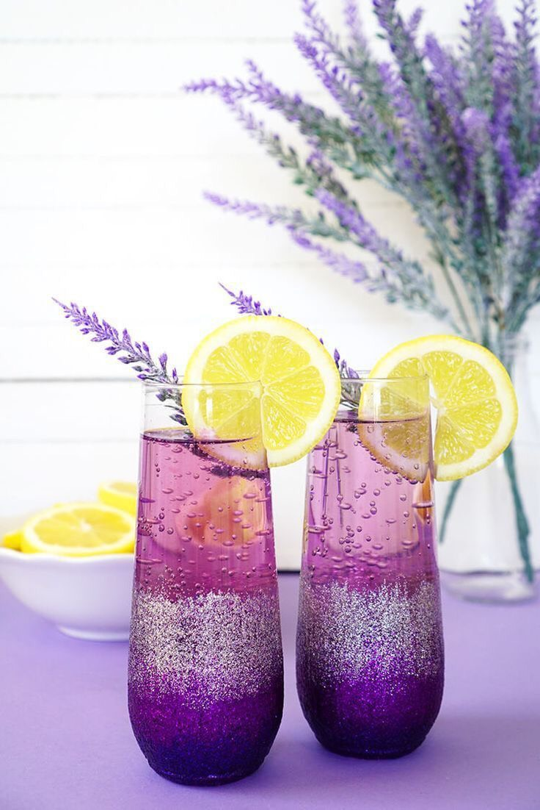
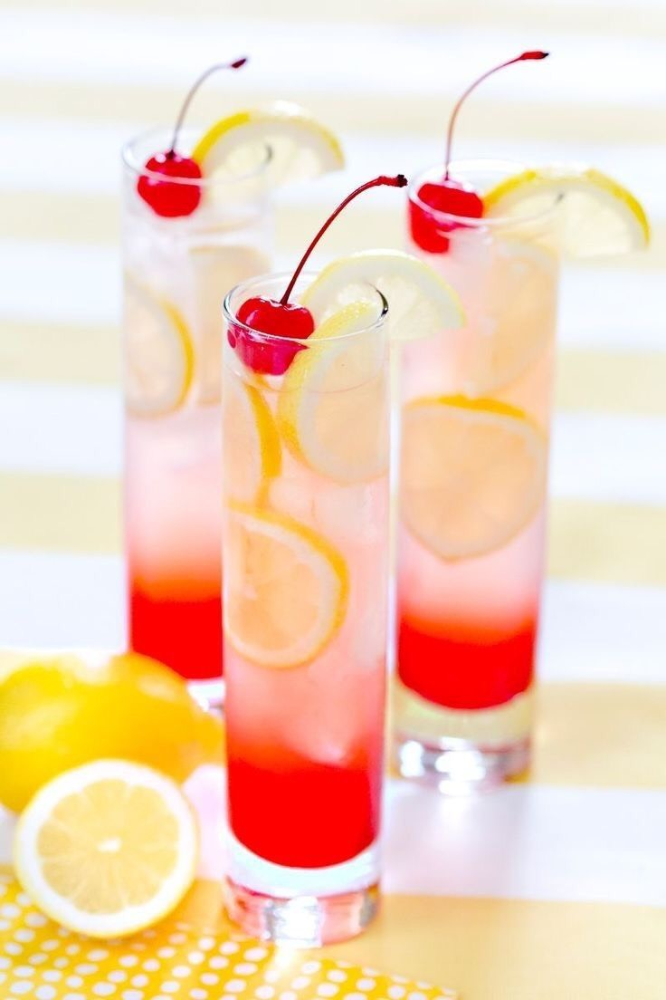
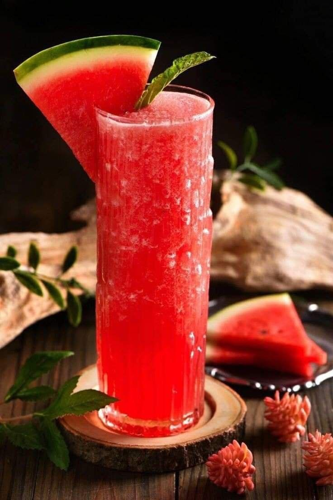
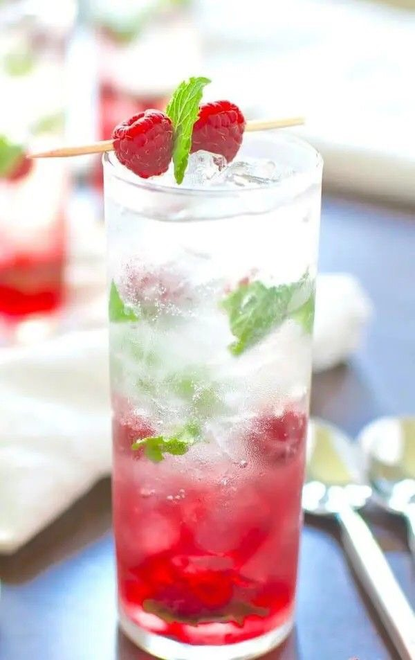
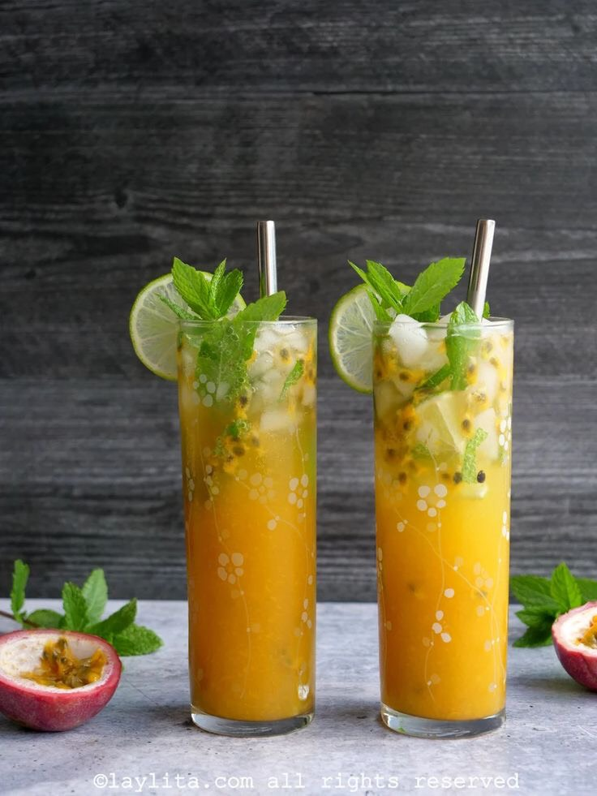
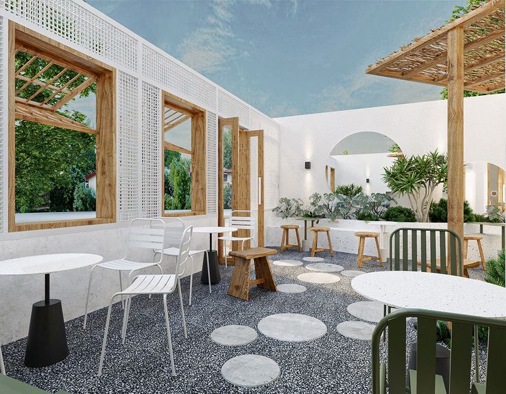
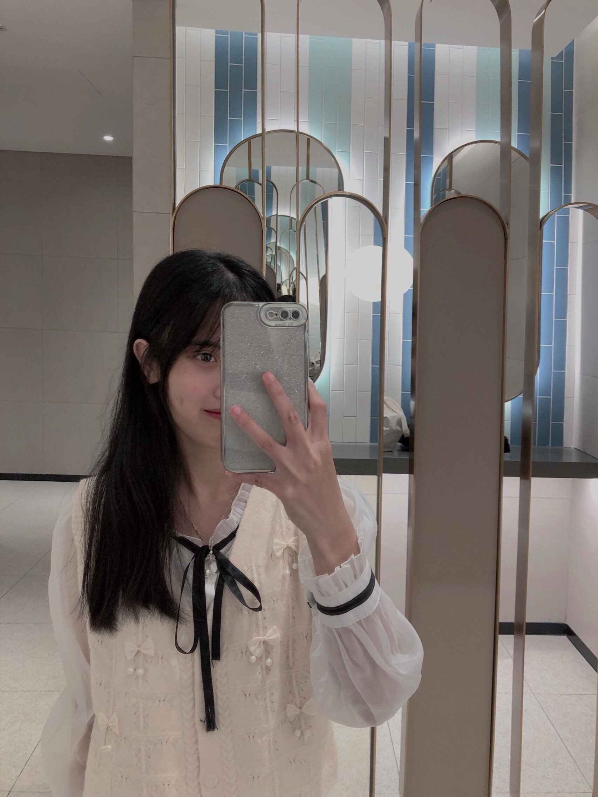

# lab6
<html>
<head>
<title>W3.CSS Template</title>
<meta charset="UTF-8">
<meta name="viewport" content="width=device-width, initial-scale=1">
<link rel="stylesheet" href="https://www.w3schools.com/w3css/4/w3.css">
<link rel="stylesheet" href="https://fonts.googleapis.com/css?family=Karma">

</head>
<body>

<!-- Sidebar (hidden by default) -->
<nav class="w3-sidebar w3-bar-block w3-card w3-top w3-xlarge w3-animate-left" style="display:none;z-index:2;width:40%;min-width:300px" id="mySidebar">
  <a href="javascript:void(0)" onclick="w3_close()"
  class="w3-bar-item w3-button">Close Menu</a>
  <a href="#food" onclick="w3_close()" class="w3-bar-item w3-button">Food</a>
  <a href="#about" onclick="w3_close()" class="w3-bar-item w3-button">About</a>
</nav>

<!-- Top menu -->

  

    
☰

    
Mail

    
Jessica Drinks

  

  
<!-- !PAGE CONTENT! -->

  <!-- First Photo Grid-->
  

    

      
      <h3>MOJITO BACARD</h3>
      
Chanh bạc hà cho mùa hè tươi mát

    

    

      
      <h3>MARGARITA</h3>
      
Đại dương xanh mát

    

    

      
      <h3>CAIPIRISIMA</h3>
      
Tình yêu chung thủy

      
???

    

    

      
      <h3>DESTORNILLA-DOR</h3>
      
Cuộc sống sắc màu

    

  

  
  <!-- Second Photo Grid-->
  

    

      
      <h3>DAIQUIRI DE FRUTILLA</h3>
      
Món quà đặc biệt cho người phụ nữ

    

    

      
      <h3>COSMOPOLITAN</h3>
      
Trà dưa hấu, làm gấu mình nha

    

    

      
      <h3>BOODY MARY</h3>
      
Kết nối đam mê

    

    

      
      <h3>SIDECA</h3>
      
Thổi bay uể oải, mệt mỏi tức thì

    

  

  <!-- Pagination -->
  

    

      <a href="#" class="w3-bar-item w3-button w3-hover-black">«</a>
      <a href="#" class="w3-bar-item w3-black w3-button">1</a>
      <a href="#" class="w3-bar-item w3-button w3-hover-black">2</a>
      <a href="#" class="w3-bar-item w3-button w3-hover-black">3</a>
      <a href="#" class="w3-bar-item w3-button w3-hover-black">4</a>
      <a href="#" class="w3-bar-item w3-button w3-hover-black">»</a>
    

  
<!-- About Section -->

  

   
  

  

    <h1 class="w3-center">Jessica Drinks</h1> 
    <h3 class="w3-center">Life happens</h3>
    
Bạn đã và đang băn khoăn mình nên đi đâu và làm gì sau một ngày dài mệt mỏi! Hãy đến với chúng tôi! Jessica Drinks sẽ cho bạn một không gian thoáng đãng với concept mới lạ theo xu hướng nhẹ nhàng.
      Không gian yên tĩnh , cảnh đẹp , phục vụ nhiệt tình , đồ uống sạch và an toàn , đẹp mắt là nơi lý tưởng cho những người bạn gặp mặt👨‍💻👨🏻‍💻

    
Jessica mang phong cách đơn giản, mộc mạc, thư giãn và dễ chịu. Đến với TÔI bạn sẽ có một không gian thoáng mát và thư giãn. Bạn có thể lựa chọn không gian trong phòng với điều hòa mát lạnh, hay tụ tập bạn bè với không gian ngoài trời thoáng mát, còn nếu bạn là người thích ở nhà tránh nóng thì đừng lo Jessica sẽ giao hàng đến tận nơi cho bạn với menu đa dạng! 

  

  

  
  
    <h3>About Me, The Drink Girl</h3> 
    
    

      <h4><b>Trần Thị Bích Ngọc</b></h4>
      <h6><i>Đam mê màu sắc từ các đồ uống</i></h6>
      
Sự sáng tạo mà họ đã kết hợp các nguyên liệu để tạo ra những công thức nước uống đầy hấp dẫn, chinh phục thị giác lẫn vị giác của người thưởng thức

    

  

    <h1>Liên Hệ</h1> 
    
Tôi luôn muốn mang tới cho các bạn các nguồn cảm hứng và trải nghiệm thú vị thông qua các màu sắc tươi mới được cảm nhận thông qua từ thị giác lẫn vị giác

    
<b>Địa chỉ: Vân Nội - Đông Anh - Hà Nội</b>

    
Bạn có thể liên hệ với chúng tôi theo số điện thoại 0375646828 hoặc email baolamm.1402@gmail.com , hặc bạn có thể nhắn tin ở dưới đây:

    <form action="/action_page.php" target="_blank">
      
<input class="w3-input w3-padding-16" type="text" placeholder="Name" required name="Name">

      
<input class="w3-input w3-padding-16" type="number" placeholder="How many people" required name="People">

      
<input class="w3-input w3-padding-16" type="datetime-local" placeholder="Date and time" required name="date" value="2023-11-24T20:00">

      
<input class="w3-input w3-padding-16" type="text" placeholder="Message \ Special requirements" required name="Message">

      
<button class="w3-button w3-light-grey w3-section" type="submit">SEND MESSAGE</button>

    </form>
  

  <!-- Footer -->
  <footer class="w3-row-padding w3-padding-32">
    

      <h3>FOOTER</h3>
      
Praesent tincidunt sed tellus ut rutrum. Sed vitae justo condimentum, porta lectus vitae, ultricies congue gravida diam non fringilla.

      
Powered by <a href="https://www.w3schools.com/w3css/default.asp" target="_blank">w3.css</a>

    

  
    

      <h3>BLOG POSTS</h3>
      <ul class="w3-ul w3-hoverable">
        <li class="w3-padding-16">
          
          Bánh Ngọt 
          Hương vị ngọt ngào của niềm vui và hạnh phúc
        </li>
        <li class="w3-padding-16">
          
          Du Lịch 
          Khám phá thế giới
        </li> 
      </ul>
    

    

      <h3>POPULAR TAGS</h3>
      

        Travel New York Dinner
        Salmon France Drinks
        Ideas Flavors Cuisine
        Chicken Dressing Fried
        Fish Duck
      

    

  </footer>

<!-- End page content -->

</body>
</html>
